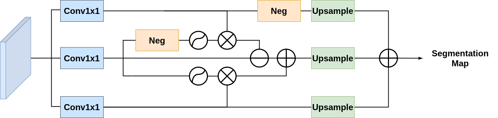
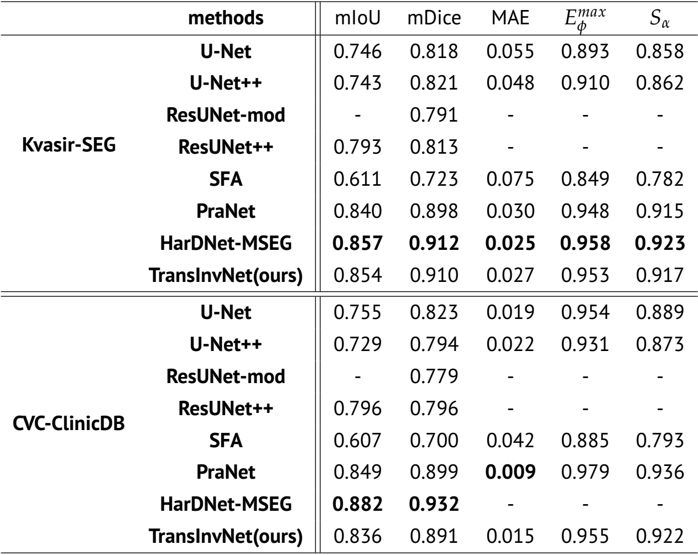
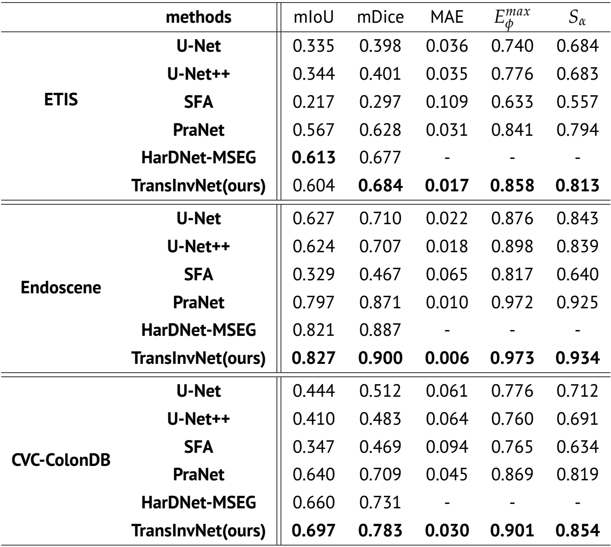

# TransInvNet: Combining Transformer and Involution Network for Polyp Segentation
___

## 1. Overview
### 1.1 Introduction
Prevention of colorectal cancer has become a world health issue. 
In clinic practice, doctors usually use colonoscopy to detect polyps, 
but accurately segmenting polyps from colonoscopy images is a challenging task. 
To address this challenge, many CNN-based methods have been proposed. 
However, pure CNN-based methods have limitations. To overcome such limitations, we propose a novel architecture namely TransInvNet for accurate polyp segmentation in colonoscopy images.
To be more specific, we combine the recently proposed involution network with vision transformer
in two parallel branches, and then combine their output features. Based on the combined feature,
we then use a simple decoder architecture with skip-connections to increase the resolution while decrease
the channels step by step. Finally, we propose an attention segmentation module to combine attention map with
reverse attention map together, which is able to help us distinguish polyp from its surrounding tissues and
improve segmentation accuracy. Our method achieves great result on Kvasir dataset (mDice 0.910), and it also holds a good
 generalization ability on those unseen dataset (ETIS, CVC-ColonDB, Endoscene).

### 1.2 Network Architecture

<p align="center">Figure 1: Architecture of proposed TransInvNet, 
which consists two parallel branches of RedNet and ViT respectively with a simple decoder.</p>


<p align="center">Figure 2: Architecture of attention segmentation module.</p>

### 1.3 Quantitative Results
Our train/test split policy follows [PraNet: Parallel Reverse Attention Network for Polyp Segmentation](https://arxiv.org/abs/2006.11392). 900
 images from Kvasir-SEG and 550 images from CVC-ClinicDB are used for training, while rest images of these 2 datasets and CVC-ColonDB, ETIS, test set of Endoscene 
are used for testing.


<p align="center">Figure 3: Quantitative results on Kvasir-SEG and CVC-ClinicDB datasets.</p>


<p align="center">Figure 3: Quantitative results on ETIS, Endoscene and CVC-Colon datasets.</p>

### 1.4 Qualitative Results

<p align="center">Figure 3: Qualitative results of our proposed TransInvNet compared to PraNet and HarDNet-MSEG.</p>

### 1.5 Directory Tree for TransInvNet
```
.
├── cal_params.py
├── eval.py
├── images
│ ├── framework.png
│ ├── qualitiveresult.png
│ ├── quantitativeresult1.png
│ ├── quantitativeresult2.png
│ └── segmentationhead.png
├── inference.py
├── README.md
├── requirements.txt
├── train.py
├── TransInvNet
│ ├── model
│ │ ├── backbone
│ │ │ ├── base_backbone.py
│ │ │ ├── builder.py
│ │ │ └── rednet.py
│ │ ├── basic_blocks.py
│ │ ├── config.py
│ │ ├── decoder
│ │ │   └── decoder.py
│ │ ├── model.py
│ │ └── vit
│ │     └── vit.py
│ └── utils
│     ├── dataloader.py
│     ├── involution_cuda.py
│     └── utils.py
```
## 2. Installation & Usage
In our experiments, all training/testing are conducted using [Pytorch](https://pytorch.org/) with a single RTX2080 Ti GPU.
### 2.1 Installation
* Install required libraries:<br>
  * `pip install -r requirements.txt`
* Download necessary data:<br>
  We use five datasets in our experiments: [Kvasir-SEG](https://datasets.simula.no/kvasir-seg/), [CVC-ClinicDB](http://www.cvc.uab.es/CVC-Colon/index.php/databases/),
  [CVC-ColonDB](http://www.cvc.uab.es/CVC-Colon/index.php/databases/), [ETIS](https://polyp.grand-challenge.org/EtisLarib/)
  and [EndoScene](http://www.cvc.uab.es/CVC-Colon/index.php/databases/cvc-endoscenestill/). We use the same split policy as [PraNet](https://arxiv.org/abs/2006.11392), 
  and you can download these datasets from their [repo](https://github.com/DengPingFan/PraNet#22-framework-overview). Thanks to their great work.
  * Download train dataset. This dataset can be downloaded from this [link (Google Drive)](https://drive.google.com/file/d/1lODorfB33jbd-im-qrtUgWnZXxB94F55/view). 
    Configure your `train_path` to the directory of train dataset.
  * Download test dataset. This dataset can be downloaded from this [link (Google Drive)](https://drive.google.com/file/d/1o8OfBvYE6K-EpDyvzsmMPndnUMwb540R/view). 
    Configure your `test_path` to the directory of test dataset.
* Download Pretrained weights:<br>
  Download pretrained weights for ViT and RedNet. A large part of our code is from [ViT-Pytorch](https://github.com/jeonsworld/ViT-pytorch)
  and [Involution](https://github.com/d-li14/involution). Thanks for their wonderful works.
  * Download pretrained weights for Vision Transformer at this [link](https://console.cloud.google.com/storage/browser/vit_models;tab=objects?prefix=&forceOnObjectsSortingFiltering=false). 
    We use ViT-B_16 for our experiments. Place pretrained weights into `TransInvNet/lib`.
  * Download pretrained weights for RedNet at this [link](https://hkustconnect-my.sharepoint.com/personal/dlibh_connect_ust_hk/_layouts/15/onedrive.aspx?id=%2Fpersonal%2Fdlibh%5Fconnect%5Fust%5Fhk%2FDocuments%2Finvolution%2Fcls%2Frednet50%2D1c7a7c5d%2Epth&parent=%2Fpersonal%2Fdlibh%5Fconnect%5Fust%5Fhk%2FDocuments%2Finvolution%2Fcls&originalPath=aHR0cHM6Ly9oa3VzdGNvbm5lY3QtbXkuc2hhcmVwb2ludC5jb20vOnU6L2cvcGVyc29uYWwvZGxpYmhfY29ubmVjdF91c3RfaGsvRVpqUkczcVVNdTVJdVI3WUg0R2l5YzhCNmtvUHZ1NnM4ck9sSUc4LUJ1RmV2Zz9ydGltZT14RHZoZzZZZTJVZw).
   We use RedNet-50 for our experiments. Place pretrained weights into `TransInvNet/lib`.
### 2.2 Training
`pytron train.py --epoch --lr --batch_size --accmulation --img_size --clip --cfg --train_path --test_path --output_path --seed`

For detailed information about each argument, please use `python train.py --help`.

### 2.3 Testing/Inference
To inference images using our proposed TransInvNet, you can either download our pretrained weights from this [link](https://drive.google.com/file/d/1MURnZTeUGOVYjlhFmLf3LBJeGFrz-dG5/view?usp=sharing) or 
train one by yourself. After downloading pretrained weights of TransInvNet or finishing training, configure your `weigh_path` to trained weights and 
`test_path` to images you would like to inference. Use this command to inference images.

`python inference.py --img_size --weight_path --test_path --output_path --threshold`

For detailed information about each argument, please use `python inference.py --help`

### 2.4 Evaluation
Our evaluation code is modified from [link](https://github.com/zzhanghub/eval-co-sod). To evaluation a model, you need to configure `weight_path` to the trained weights and `test_path` to the dataset you would like to evaluate. 
You can use this command to run the evaluation script.

`python eval.py --img_size --weight_path --test_path`

For detailed information about each argument, please use `python eval.py --help`

### 2.5 Acknowledge
* The code of Vision Transformer part is borrowed from [ViT-Pytorch](https://github.com/jeonsworld/ViT-pytorch).
* The code of Involution part is borrowed from [involution](https://github.com/d-li14/involution).
* Datasets used for experiments are from [PraNet](https://github.com/DengPingFan/PraNet#22-framework-overview).

## 3. Reference
* [ViT-Pytorch](https://github.com/jeonsworld/ViT-pytorch)
* [Google-ViT](https://github.com/google-research/vision_transformer)
* [PraNet](https://github.com/DengPingFan/PraNet#22-framework-overview)
* [HarDNet-MSEG](https://github.com/james128333/HarDNet-MSEG)
* [Involution](https://github.com/d-li14/involution)