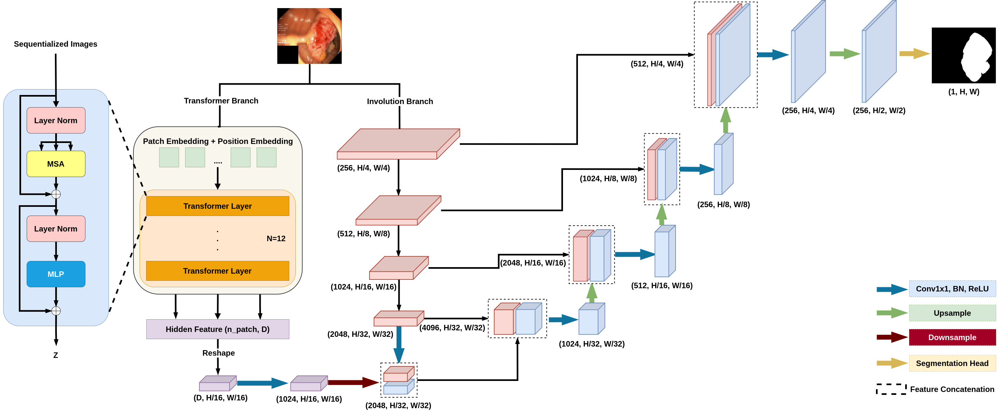

# TransInvNet: Combining Transformer with Involution Network for Polyp Segentation
___
## 1. Frame Overview

*Figure 1: Overview of the proposed network, consisting of three reverse attention modules, Vision Transformers and a RedNet backbone with RFB modules.*  
## 2. Quantitative Results
|  **Dataset**   | **Mean DICE** |**mIOU** | **Average MAE** | **S-Measure** | **Max E-Measure** |
|  ----  | ----  | ---- | ---- | ---- | ---- |
| **Kvasir-SEG**  | 0.901 | 0.844 | 0.030 | 0.913 | 0.952 |
| **CVC-612**  | 0.935 | 0.889 | 0.014 | 0.944 | 0.977 |
| **ETIS**| 0.682 | 0.601 | 0.042 | 0.803 | 0.839 |
| **EndoScene**| 0.841 | 0.754 | 0.018 | 0.890 | 0.938 |